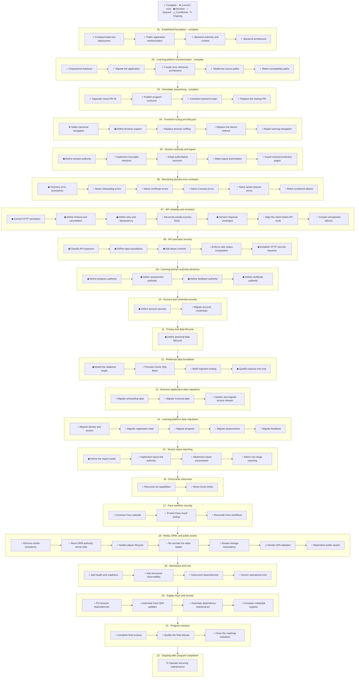

# Project roadmap

```mermaid
flowchart TB
  legend["✓ Complete · ★ Current / next · ◆ Decision · ○ Queued · △ Conditional · ↻ Ongoing"]

  subgraph T01["01 · Established foundation · complete"]
    direction LR
    t01a["✓ Frontend build and deployment"] --> t01b["✓ Public application modernization"] --> t01c["✓ Backend authority and runtime"] --> t01d["✓ Backend architecture"]
  end

  subgraph T02["02 · Learning-platform transformation · complete"]
    direction LR
    t02a["✓ Characterize behavior"] --> t02b["✓ Migrate the application"] --> t02c["✓ Create error reference architecture"] --> t02d["✓ Modernize source paths"] --> t02e["✓ Retire compatibility paths"]
  end

  subgraph T03["03 · Immediate sequencing · complete"]
    direction LR
    t03a["✓ Separate mixed PR 56"] --> t03b["✓ Publish program contracts"] --> t03c["✓ Centralize backend origin"] --> t03d["✓ Replace the markup PR"]
  end

  subgraph T04["04 · Frontend routing and lifecycle"]
    direction LR
    t04a["★ Settle canonical navigation"] --> t04b["◆ Define browser support"] --> t04c["○ Replace browser sniffing"] --> t04d["○ Replace the device redirect"] --> t04e["○ Repair warning navigation"]
  end

  subgraph T05["05 · Session authority and logout"]
    direction LR
    t05a["◆ Define session authority"] --> t05b["○ Implement revocable sessions"] --> t05c["○ Adopt authoritative sessions"] --> t05d["○ Make logout authoritative"] --> t05e["○ Guard restored protected pages"]
  end

  subgraph T06["06 · Remaining domain error contracts"]
    direction LR
    t06a["◆ Inventory error boundaries"] --> t06b["○ Name onboarding errors"] --> t06c["○ Name certificate errors"] --> t06d["○ Name Conecta errors"] --> t06e["○ Name quote-request errors"] --> t06f["○ Retire numbered aliases"]
  end

  subgraph T07["07 · API reliability and evolution"]
    direction LR
    t07a["◆ Correct HTTP semantics"] --> t07b["◆ Define timeout and cancellation"] --> t07c["◆ Define retry and idempotency"] --> t07d["○ Reconcile partial-success flows"] --> t07e["◆ Version response envelopes"] --> t07f["○ Align the client-intake API route"] --> t07g["○ Contain unexpected failures"]
  end

  subgraph T08["08 · API perimeter security"]
    direction LR
    t08a["◆ Classify API exposure"] --> t08b["◆ Define input boundaries"] --> t08c["◆ Add abuse controls"] --> t08d["○ Enforce safe output composition"] --> t08e["◆ Establish HTTP security baseline"]
  end

  subgraph T09["09 · Learning-domain authority decisions"]
    direction LR
    t09a["◆ Define progress authority"] --> t09b["◆ Define assessment authority"] --> t09c["◆ Define feedback authority"] --> t09d["◆ Define certificate authority"]
  end

  subgraph T10["10 · Account and credential security"]
    direction LR
    t10a["◆ Define account security"] --> t10b["○ Migrate account credentials"]
  end

  subgraph T11["11 · Privacy and data lifecycle"]
    direction LR
    t11a["◆ Define personal-data lifecycle"]
  end

  subgraph T12["12 · Relational data foundation"]
    direction LR
    t12a["◆ Model the relational target"] --> t12b["○ Provision Azure SQL Basic"] --> t12c["○ Build migration tooling"] --> t12d["◆ Qualify capacity and cost"]
  end

  subgraph T13["13 · Business-application data migrations"]
    direction LR
    t13a["○ Migrate onboarding data"] --> t13b["○ Migrate Conecta data"] --> t13c["○ Harden and migrate access release"]
  end

  subgraph T14["14 · Learning-platform data migrations"]
    direction LR
    t14a["○ Migrate identity and access"] --> t14b["○ Migrate registration state"] --> t14c["○ Migrate progress"] --> t14d["○ Migrate assessments"] --> t14e["○ Migrate feedback"]
  end

  subgraph T15["15 · Secure status reporting"]
    direction LR
    t15a["◆ Define the report model"] --> t15b["○ Implement report-link authority"] --> t15c["○ Modernize report presentation"] --> t15d["○ Retire row-range reporting"]
  end

  subgraph T16["16 · Excel-write retirement"]
    direction LR
    t16a["○ Reconcile all capabilities"] --> t16b["○ Retire Excel writes"]
  end

  subgraph T17["17 · Face workflow security"]
    direction LR
    t17a["○ Constrain Face uploads"] --> t17b["○ Protect Face-result lookup"] --> t17c["○ Reconcile Face workflows"]
  end

  subgraph T18["18 · Media, DRM, and public assets"]
    direction LR
    t18a["○ Remove media exceptions"] --> t18b["○ Move DRM authority server-side"] --> t18c["○ Harden player lifecycle"] --> t18d["○ Re-encode the video ladder"] --> t18e["○ Review storage redundancy"] --> t18f["△ Decide CDN adoption"] --> t18g["○ Rationalize public assets"]
  end

  subgraph T19["19 · Operations and cost"]
    direction LR
    t19a["○ Add health and readiness"] --> t19b["○ Add structured observability"] --> t19c["○ Instrument dependencies"] --> t19d["○ Govern operational cost"]
  end

  subgraph T20["20 · Supply chain and secrets"]
    direction LR
    t20a["○ Pin browser dependencies"] --> t20b["○ Automate Face SDK updates"] --> t20c["○ Automate dependency maintenance"] --> t20d["○ Complete credential hygiene"]
  end

  subgraph T21["21 · Program closeout"]
    direction LR
    t21a["○ Complete final reviews"] --> t21b["○ Qualify the final release"] --> t21c["○ Close the roadmap milestone"]
  end

  subgraph T22["22 · Ongoing after program completion"]
    direction LR
    t22a["↻ Operate recurring maintenance"]
  end

  legend ~~~ T01
  T01 --> T02
  T02 --> T03
  T03 --> T04
  T04 --> T05
  T05 --> T06
  T06 --> T07
  T07 --> T08
  T08 --> T09
  T09 --> T10
  T10 --> T11
  T11 --> T12
  T12 --> T13
  T13 --> T14
  T14 --> T15
  T15 --> T16
  T16 --> T17
  T17 --> T18
  T18 --> T19
  T19 --> T20
  T20 --> T21
  T21 --> T22
```
